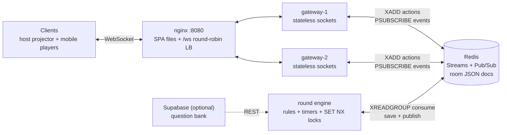

# ConsensusKill — *MinorityRule*

[](https://github.com/himkarr/consensuskill/actions/workflows/ci.yml)
[](https://github.com/himkarr/consensuskill/actions/workflows/deploy.yml)

A real-time multiplayer **liar game**: every round presents a silly dilemma, everyone
votes in secret, and the *minority* side survives — the majority loses a life. Bluff in
chat, read the room, and don't get left holding the popular opinion. Built for a
Cloud & Distributed Systems assessment: **React/Vite SPA → nginx → stateless
WebSocket gateways (N replicas) → Redis (Streams + Pub/Sub) → a single authoritative
round engine**.

---

## 1. The game

1. Host creates a room → 6-character code (`ABC234`) + QR join link.
2. ≥ 3 players, everyone starts with **2 lives**.
3. Round (~48s): **Question 5s → Discussion 20s (chat) → Vote 10s (secret) →
   Reveal 8s → Apply 5s**.
4. The minority choice survives; majority voters lose 1 life.
   - **Unanimous** → void round (no minority exists)
   - **Tie** → no lives lost, replay the dilemma
   - **No vote / AFK** → automatic −1 life
   - **Duplicate or late vote** → only the first valid vote inside the window counts
5. 0 lives → spectator (watch + chat). Last player/team standing wins.
6. Disconnects are safe: reconnect with the stored player token and keep your lives.

---

## 2. Architecture



ASCII version:

```
   ┌──────────────┐   ┌──────────────┐
   │ host/projector│   │mobile players│
   └──────┬───────┘   └──────┬───────┘
          │  WebSocket       │
          └────────┬─────────┘
                   ▼
        ┌─────────────────────┐  nginx: SPA + /ws
        │      nginx :8080    │  round-robin,
        └──────────┬──────────┘  upgrade headers,
          ┌────────┴────────┐    1h read timeout
          ▼                 ▼
   ┌─────────────┐   ┌─────────────┐
   │  gateway-1  │   │  gateway-2  │   stateless: sockets only
   └──────┬──────┘   └──────┬──────┘
          │ XADD actions    │
          │ PSUBSCRIBE ck:room:*:events
          └────────┬────────┘
                   ▼
            ┌─────────────┐      ┌──────────────────┐
            │    Redis    │◀────▶│   round engine   │
            └─────────────┘      └──────────────────┘
             streams             single consumer group
             pub/sub             per-room SET NX lock
             room JSON docs      pure rules + timers
```

**Data flow for one action** (e.g. a vote):

```
browser --ws--> gateway --XADD ck:ingest--> engine --lock--> pure rules
                                                              │ save room JSON
browser <--ws-- gateway <--PUBLISH ck:room:CODE:events--------┘
```

Why this shape:

| Decision | Reason |
|---|---|
| Gateways are **stateless** | only sockets in memory → any client lands on any replica; scale with `--scale gateway=N` |
| **One JSON room document** in Redis | a phase transition is one atomic `SET`; no cross-row races |
| **Single writer** (round engine) + `SET NX` lock | no split brain: even two engine replicas can't double-advance or double-count a round |
| Redis **Streams** for actions | ordered, crash-safe consumer group; a dead engine's pending messages are reclaimed (`XAUTOCLAIM`) |
| **Pub/Sub** for events | N gateways fan out to their local sockets with one pattern subscription |
| **Server-stamped timers** | every screen counts down to the same `timer_ends_at`; clients can't cheat the clock |

---

## 3. Quickstart

### Docker (recommended)

```bash
git clone https://github.com/himkarr/consensuskill.git
cd consensuskill
docker compose up --build
# open http://localhost:8080  (nginx → gateway×2 → engine → redis)
docker compose up --build --scale gateway=3   # more socket replicas
```

### Local processes (no Docker)

```bash
scripts/dev.sh up       # redis + engine :8001 + gateway :8000 + frontend :4173
scripts/dev.sh logs
scripts/dev.sh down
```

Requires: `redis-server` on `PATH`, Python 3.11 venv (`.venv`), `frontend/node_modules`.

### Verify everything (the four gates)

```bash
.venv/bin/ruff check .                                 # lint
.venv/bin/pytest -q -o faulthandler_timeout=60         # 76 tests
cd frontend && npm run typecheck && npm test           # tsc + 14 vitest
cd frontend && npm run build && npm run smoke          # 21 Playwright checks (stack up)
```

### Bot swarm (load / resilience demo)

```bash
.venv/bin/python scripts/bot.py --url ws://127.0.0.1:8000/ws \
  --players 5 --rooms 2 --strategy trap --timeout 135
# kill a gateway mid-match, watch clients reconnect with their tokens:
curl -X POST http://127.0.0.1:8000/admin/kill
```

---

## 4. How it works (the three things to know)

**Distributed state sync.** Gateways never own game state. Every client action is
appended to one Redis Stream (`ck:ingest`); the engine consumes it with a consumer
group, applies the pure rules from `engine/rules.py`, writes the room's single JSON
document, and publishes the new state to `ck:room:{code}:events`. Every gateway holds
one pattern subscription and forwards events to its own sockets — so a chat message
from a player on gateway-1 is visible to a player on gateway-2 within milliseconds,
and all screens render the *same* server-stamped countdown.

**Split-brain avoidance during voting.** Votes are messages, not local state: they are
serialized by stream order and applied by exactly one writer. Each transition takes a
`SET NX PX` per-room lock, so a second engine replica (or a slow zombie holding an old
lock) gets `BUSY` and backs off instead of counting votes twice. The server clock
decides `late`, the first write decides `duplicate`, and an append-only audit stream
(`ck:room:{code}:votes`) records what was accepted. Ties/unanimous/AFK are resolved by
the pure `compute_minority()` — no I/O, fully unit-tested.

**Horizontal scaling.** Gateways hold only a `ConnectionRegistry` (conn → socket,
room → conns): add replicas behind nginx and the load balancer spreads both HTTP and
WebSocket upgrades (`docker compose up --scale gateway=3`). Cross-node fan-out rides
Redis Pub/Sub; reconnects ride the token → room index, so a client evicted from
gateway-1 resumes on gateway-2 with its lives intact. The engine is separately
scalable and safe to run in-process (`EMBEDDED_ENGINE=1`) when a free tier only fits
one service. A wake channel + deadline-cached timer loop keeps a hosted Redis (Upstash
500K commands/month) inside budget.

**Fault tolerance demo (verified):** `POST /admin/kill` hard-kills a gateway;
browsers/bots back off, reconnect, replay `{type:"reconnect", token}` and continue the
same round — lives, votes and chat intact.

---

## 5. Deployment (free tier, no credit card)

| Piece | Provider | Notes |
|---|---|---|
| Static SPA | Vercel | `vercel.json` at repo root; set `VITE_WS_URL=wss://<render>/ws` |
| Backend (gateway+engine in one process) | Render | `render.yaml` blueprint (image CMD + env pins); 750 h/month = exactly one service |
| Redis | Upstash | `rediss://`, 500K cmds/month — engine tuned to stay under it |
| Question bank (optional) | Supabase | `supabase/questions.sql` + `scripts/seed_supabase.py` |
| Images + CD | GitHub Actions → ghcr.io → VM | `.github/workflows/deploy.yml` (gate → push → SSH/hook) |

Step-by-step: see **`details.md` §12**. Verify a hosted Redis with
`python scripts/smoke_upstash.py`. Note: Render's free service sleeps after ~15 min
idle (sockets drop → clients auto-reconnect).

---

<!-- ## 6. Presentation script (2–3 minutes)

> **Hook (10s).** ConsensusKill is a multiplayer liar game where the *minority* wins
> the round. The interesting part isn't the rules — it's that ten phones, a projector,
> two load-balanced gateway nodes and one round engine all agree on the same state
> within milliseconds, and nobody can vote twice or late.
>
> **Distributed state sync (45s).** The gateways are deliberately stateless: each one
> holds only sockets. A vote from any phone becomes a message appended to a single
> Redis Stream. The round engine is the only process that applies game rules; it reads
> that stream with a consumer group, mutates one JSON room document, and publishes the
> result to a per-room Pub/Sub channel. Every gateway subscribes with one pattern and
> fans the event out to its local sockets. That's the whole sync story: one source of
> truth, ordered input, broadcast output. Even the clocks are server-stamped — every
> client counts down to the same `timer_ends_at`, so screens can't drift or lie.
>
> **Split-brain avoidance in voting (45s).** Three layers. First, single writer: only
> the engine applies votes, in stream order, so there is no concurrent counting. Second,
> a per-room `SET NX` lock with a TTL means that even if a second engine replica wakes
> up, or a crashed one leaves a stale lock, at most one process can commit a phase
> transition — the loser gets `BUSY` and retries later, never double-counts. Third,
> the server clock: late votes are judged against `timer_ends_at`, duplicates are
> acked-and-ignored, and an append-only audit stream records every accepted vote.
> Tie, unanimous and AFK outcomes fall out of the pure `compute_minority` function,
> which is unit-tested with zero services involved.
>
> **Horizontal scaling (45s).** Because gateways hold no state, scaling is
> `docker compose up --scale gateway=3` behind nginx — connections and upgrades spread
> round-robin, cross-node chat flows through Pub/Sub, and a client dropped from
> gateway-1 reconnects to gateway-2 with its token and keeps its lives. That's the
> kill-a-gateway demo. The engine scales separately; for free-tier hosts that only fit
> one process it runs embedded behind the gateway. And to keep hosted Redis inside its
> monthly command budget, actions publish a wake ping and the timer loop sleeps until
> its cached deadline instead of polling.
>
> **Close (10s).** 76 backend tests, 14 frontend tests, a 21-check browser smoke test
> and a four-job CI pipeline that also boots the whole Docker stack and smoke-tests it
> through the load balancer.

---

## 7. Interview talking points

**Why Redis Streams (and not just Pub/Sub) for votes?**
Pub/Sub fires and forgets — a restart loses messages. Streams are durable, ordered,
and give a consumer group with acknowledgements: if the engine dies mid-batch,
`XAUTOCLAIM` re-delivers the unacked actions after 30s idle. Exactly-once *effect* via
idempotent handlers + ack-after-process.

**How do you prevent double-processing / split brain?**
Every mutation goes through `_mutate()`: `SET NX PX` room lock → load → pure rule →
`SET` save → release. Lock TTL bounds a crash (it expires); a contender gets `BUSY`
and retries. Combined with a single consumer group for actions, a vote is applied once.

**What breaks if Redis restarts?**
Local/compose Redis runs with persistence off: rooms vanish (demo-accepted, documented).
Upstash persists. Clients notice via the socket closing and would reconnect into a
fresh lobby — game state was never client-authoritative.

**Why does the client trust the server clock?**
The engine stamps `timer_ends_at`; clients only measure the offset between their clock
and the server's, then render the countdown. Vote windows are evaluated server-side.

**How would you persist match outcomes / a leaderboard?**
`store.audit_vote` already writes every accepted vote to a stream; a small consumer
could flush rounds into Supabase (the optional question-bank integration shows the
REST path). Currently documented as an open gap.

**What is the cost/efficiency story?**
Naive polling would burn ~2.6M Redis reads/month on the free tier. Instead: wake
Pub/Sub on every action, a deadline-cached timer loop with a 30s rescan, non-blocking
`XREADGROUP` (`BLOCK` is forbidden on Upstash), and `MAXLEN`-trimmed streams —
~225K commands/month idle, ~45% of budget. Measured reasoning is in `details.md` §12.

**Where are the single points of failure?**
Redis (mitigated by managed Upstash + atomic single-writer design) and the free-tier
single Render instance (sleeps, cold-starts ~1 min). Gateways and the engine are
replaceable at any moment; state lives in Redis, not in processes.

--- -->

## 6. Project layout

```
consensuskill/
├── shared/     wire schemas, Redis keys, bus helpers, question loader
├── engine/     pure rules + locks + timers + consumer (authoritative)
├── gateway/    stateless WebSocket front door
├── frontend/   React SPA (projector + player views), Playwright smoke
├── deploy/     render-entry.sh (Render), vm-deploy.sh (SSH CD)
├── docker/     nginx config (SPA + /ws load balancer)
├── scripts/    dev.sh, bot.py, seed_supabase.py, smoke_upstash.py
├── tests/      76 pytest (rules, minority, engine over fakeredis, full WS)
└── data/       bundled 40-question bank
```

Deep documentation: **[`details.md`](details.md)** — data model, wire protocol,
environment variables, phase-4/5 deployment notes, design decisions.
Assignment brief: [`SPEC.md`](SPEC.md).
